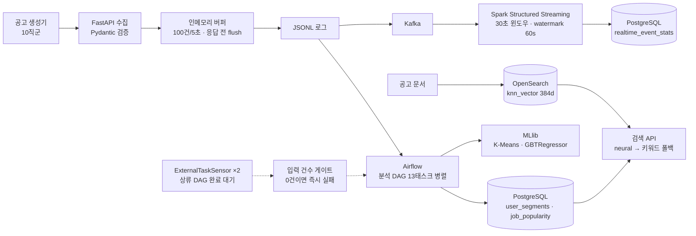

# Illo-on — 채용 공고 검색·추천 파이프라인

구직자의 행동 로그를 수집해 검색과 추천에 반영하는 파이프라인. 수집부터 서빙까지 전 구간을 구현했고,
프로젝트 종료 후 성능·안정성을 단독으로 재점검해 문제를 고치고 전후를 실측했다.

| 개선 | 전 | 후 |
|---|---|---|
| DagRun p50 | 126.3s | **74.2s (−41%)** |
| 성공 응답 시점 디스크 미반영 | 100건 | **0건** |
| 35,000건 bulk 색인 | HTTP 413으로 0건 | **5.444초 전량 성공** |

측정 조건과 원본 수치: [BENCHMARK.md](BENCHMARK.md) · [IMPROVEMENTS.md](IMPROVEMENTS.md) ·
`bench/results/*.json`

## 아키텍처



## 더 자세히

프레임워크 내부와 데이터 모델은 따로 문서로 뒀다.

| 문서 | 내용 |
|---|---|
| [docs/architecture/spark.md](docs/architecture/spark.md) | Structured Streaming 파이프라인, 배치 잡 4개, MLlib 구성 |
| [docs/architecture/airflow.md](docs/architecture/airflow.md) | DAG 3개 태스크 그래프, 센서 `execution_delta` 근거, 게이트 |
| [docs/architecture/data-model.md](docs/architecture/data-model.md) | ERD, 테이블 DDL, OpenSearch 매핑, **이벤트 스키마 불일치** |
| [docs/adr](docs/adr) | 설계 결정 6건 (기각한 대안 포함) |

## 데이터 흐름

| 단계 | 입력 | 처리 | 출력 | 쓰기 방식 |
|---|---|---|---|---|
| 수집 | 행동 이벤트 JSON | Pydantic 검증 → 버퍼(100건/5초) | JSONL | append, **응답 전 동기 flush** |
| 전달 | JSONL | Kafka produce | 토픽 | append-only |
| 스트리밍 | Kafka | 30초 텀블링 윈도우, watermark 60s | `realtime_event_stats` | **append-only INSERT** (upsert 아님) |
| 배치 | 원본 로그 | 13태스크 병렬 집계 | `user_segments`, `job_popularity` | **`DELETE FROM` 후 INSERT (멱등)** |
| 학습 | 집계 지표 | K-Means(K=4) · GBTRegressor | 세그먼트·인기도 점수 | **매일 02:00 재학습** |
| 색인 | 공고 문서 | 임베딩 384d → bulk(건수+바이트 청킹) | OpenSearch | refresh_interval 조정 후 복구 |
| 서빙 | 검색어 | neural → 결과 없으면 키워드 폴백 | API 응답 | — |

## 문제 정의

- 데이터: 채용 공고를 외부에서 확보할 수 없어 10직군 공고 생성기와 행동 로그 시뮬레이터를
  앞단에 두었다. **실사용 트래픽은 없다.**
- 성공 기준: 로그 수집부터 학습·서빙까지 한 바퀴가 재실행 가능한 형태로 도는 것.

## 검색 품질 — neural 을 넣을 값이 있었나

공고를 10직군으로 나눠 생성했으므로 각 공고에 정답 직군 라벨이 이미 있다.
"이 검색어의 정답 = 해당 직군의 공고"로 두고 직군당 5개씩 **50개 쿼리**로 측정했다.
검색어는 공고 제목을 베끼지 않고 구직자가 칠 법한 말로 적었다(제목을 베끼면 키워드 검색이 유리해진다).

```bash
python bench/eval_search.py --mode all
```

| 방식 | Recall@1 | Recall@3 | Recall@5 | MRR | nDCG@3 | nDCG@5 |
|---|---|---|---|---|---|---|
| keyword | **0.720** | 0.540 | 0.653 | **0.781** | 0.582 | 0.647 |
| neural | 0.700 | **0.587** | **0.700** | 0.773 | **0.613** | **0.679** |
| hybrid(폴백) | 0.700 | 0.587 | 0.700 | 0.773 | 0.613 | 0.679 |

**neural 이 이기기도 하고 지기도 한다.** Recall@3 은 +8.7%, nDCG@3 은 +5.3% 나아졌지만
Recall@1 과 MRR 은 오히려 조금 나쁘다. 상위 1건을 맞히는 능력은 키워드가 낫고,
상위 3~5건 안에 정답을 모아오는 능력은 neural 이 낫다.

**hybrid 가 neural 과 완전히 같다** — neural 이 빈 결과를 낸 적이 없어 폴백이 한 번도
발동하지 않았다. 폴백 경로는 현재 트래픽에서 사실상 죽은 코드다.

직군별로 보면 편차가 훨씬 크다 (Recall@3):

| 직군 | keyword | neural | 차이 |
|---|---|---|---|
| 기획/PM | 0.600 | **0.933** | +0.333 |
| QA/테스트 | 0.600 | **0.867** | +0.267 |
| AI/ML | 0.333 | **0.533** | +0.200 |
| 보안 | 0.400 | **0.600** | +0.200 |
| 프론트엔드 | 0.467 | 0.467 | 0 |
| 인프라/DevOps | 0.267 | 0.267 | 0 |
| 데이터 | **0.733** | 0.667 | −0.067 |
| 게임 | **0.867** | 0.667 | −0.200 |
| **백엔드/서버** | **0.533** | 0.200 | **−0.333** |

백엔드에서 neural 이 크게 진다. 직군 간 어휘가 겹치는 구간(서버·API·데이터베이스가
데이터/인프라 공고에도 나온다)에서 임베딩이 섞이는 것으로 보인다.

> **한계**: 고유 공고가 **30건**(직군당 3건)뿐이다. 벤치마크에 쓴 5,000건은 이 30건을
> 복제한 것이라 검색 평가에 쓸 수 없다. 그래서 k 를 1/3/5 로 낮춰 측정했다.
> 또한 합성 공고라 실제 채용 공고보다 직군 구분이 뚜렷하다 — **수치는 낙관적으로 읽어야 한다.**

## 설계 결정

결정과 기각한 대안은 [docs/adr](docs/adr) 에 있다.

- [ADR-0001](docs/adr/0001-storage-split-by-query-type.md) 조회 성격에 따른 저장소 분리
- [ADR-0002](docs/adr/0002-dag-dependency-and-input-gate.md) DAG 의존성 재정의와 입력 게이트
- [ADR-0003](docs/adr/0003-sync-flush-before-response.md) 응답 전 동기 flush
- [ADR-0004](docs/adr/0004-bulk-chunk-size-and-bytes.md) bulk 건수·바이트 이중 제한
- [ADR-0005](docs/adr/0005-embedding-ingest-pipeline.md) 임베딩 ingest pipeline — **측정 결과 기각** (111배 저하)

## 운영 설계

- **재실행**: 배치 분석은 멱등하다. `user_segments`·`job_popularity` 모두 적재 전
  `DELETE FROM` 을 돈다. 같은 입력으로 재실행해 300행 → 300행(중복 0) 확인.
  스트리밍 적재는 append-only 라 멱등하지 않다 — 체크포인트 유실 시 중복이 생길 수 있다.
- **데이터 품질**: 입력 건수 게이트(0건이면 `AirflowFailException`, 재시도 없음),
  Pydantic 검증 + ISO 8601 강제, bulk 부분 실패를 일시적(429/5xx)과 영구로 분리해 원인별 집계
- **상류 의존**: `ExternalTaskSensor` 2개, `mode="reschedule"` 로 대기 중 워커 슬롯 미점유

## 실행 방법

### 전제조건

- **Python 3.9** — 코드가 `typing.List` 계열을 쓴다 (PEP 585 미적용). 3.10+ 에서도 돌지만
  검증은 3.9.7 에서만 했다.
- **Java 17** — PySpark 3.3.4 용. `JAVA_HOME` 설정 필요.
- Docker Desktop

```bash
python -m venv .venv && source .venv/Scripts/activate   # Windows Git Bash
# source .venv/bin/activate                              # macOS / Linux
pip install -r requirements.txt
```

가상환경 없이 시스템 파이썬을 쓸 거면 `python` 이 3.9 를 가리키는지 먼저 확인할 것
(`python -c "import sys; print(sys.version)"`). 여러 버전이 깔린 PC 에서는
`py -3.9 -m pip install -r requirements.txt` 처럼 런처로 버전을 못박는 편이 안전하다.

### 인프라

```bash
docker compose up -d opensearch postgres
docker compose run --rm airflow-init          # Airflow DB 초기화 (최초 1회)
docker compose up -d airflow-scheduler
```

### 데이터 생성 · 실행

```bash
python bench/make_dag_input.py --per-category 200                          # 공고 2,000건
ANALYSIS_BASE_DIR=. python user_event_generator.py --users 300 --days 30   # 이벤트 24만건

python -m pytest tests/ -q                    # 테스트 4개
python bench/eval_search.py --mode all        # 검색 품질 (OpenSearch 필요)
```

`eval_search.py` 는 `--mode neural`/`all` 일 때 ML 모델을 등록·배포한다. 최초 실행은 수 분 걸린다.

벤치마크 상세는 [BENCHMARK.md](BENCHMARK.md) 의 각 절 상단에 재현 명령이 있다.

## 측정 조건

단일 노드 · Python 3.9.7 · Airflow 2.9.3(LocalExecutor) · OpenSearch 2.13(heap 2GB) · Spark 3.3.4
AMD Ryzen 7 7800X3D(8C/16T) · RAM 63GB

- 수집 부하: 동시 20 · 총 20,000건 · 3회
- DAG: 공고 2,000건 · 이벤트 244,839건 · 3회
- 색인: 문서 5,000~50,000건 · 3회
- 검색 품질: 코퍼스 30건 · 쿼리 50개

## 남은 과제

- 강제 종료 시 버퍼(최대 100건 / 5초) 유실 가능 → WAL 또는 수신 즉시 Kafka 기록
- bulk 재시도 1회 → 지수 백오프
- 스트리밍 적재가 append-only — 유니크 키나 upsert 가 없어 재처리 시 중복 가능
- **`analysis_4`(매칭 점수 구간별 전환율)는 계산할 수 없다.** 조회와 지원을 잇는 키가
  이벤트 스키마에 없다. 현재는 `(user_id, job_id)` 로 조인하는데 같은 사용자가 같은 공고를
  여러 번 보면 팬아웃이 생긴다(쌍당 평균 1.30회). 그래서 결과가 10.6%로 나오지만
  설계상 참값은 6.95%다. 이벤트에 `view_id` 를 넣어야 고칠 수 있다.
- **추천 정확도는 측정하지 않았다.** 행동 로그가 시뮬레이터 산출물이고 전환율이
  상수로 박혀 있어(AI 북마크 0.20 / 지원 0.35, 일반 0.12 / 0.20), 모델을 평가하면
  시뮬레이터 규칙을 얼마나 복원했는지를 재는 셈이다. 근거는
  [ADR-0009](docs/adr/0009-why-recommendation-accuracy-not-measured.md) 에 적었다.
