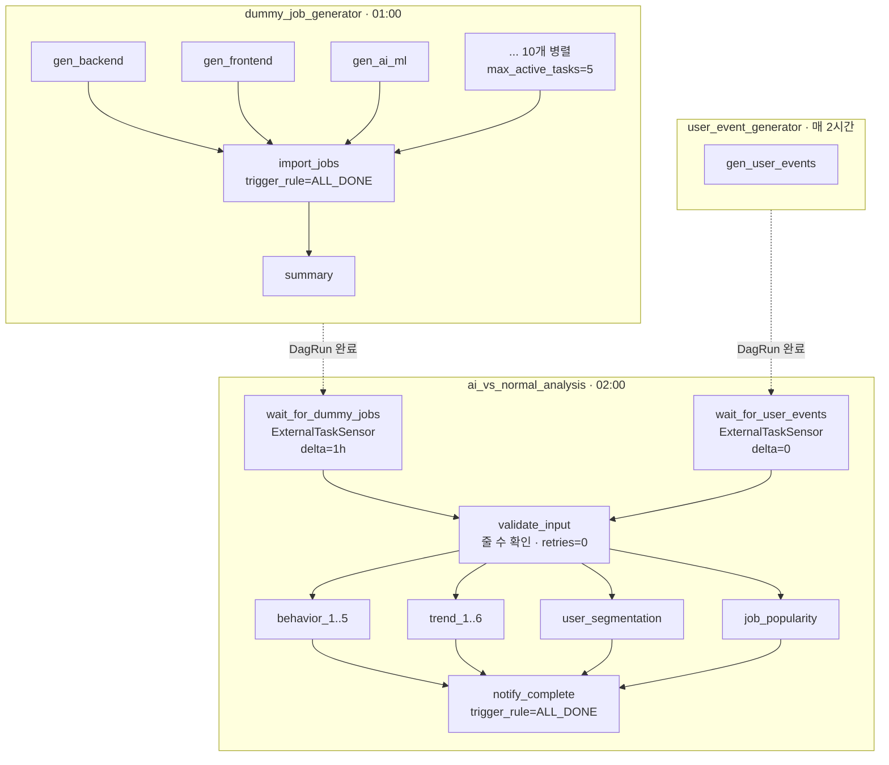

# Airflow 내부 구조 — Illo-on

DAG 파일은 4개지만 **활성은 3개**다. `job_scraper_dag.py` 는 `dags/.airflowignore`
에 등록돼 로드되지 않는다 (Playwright 스크래퍼 → 더미 생성기로 대체됨).

| DAG | 스케줄 | 태스크 | 역할 |
|---|---|---|---|
| `dummy_job_generator` | `0 1 * * *` | 12 | 직군별 공고 생성 → import API |
| `user_event_generator` | `0 */2 * * *` | 1 | 행동 이벤트 생성 |
| `ai_vs_normal_analysis` | `0 2 * * *` | 17 | Spark 분석 + MLlib |
| ~~`job_scraper`~~ | — | — | `.airflowignore` 로 비활성 |

실행기는 **LocalExecutor**, 컨테이너 1개. 메타DB 는 PostgreSQL(`airflow` DB).

---

## 전체 의존 관계



---

## 1. `ai_vs_normal_analysis` — 분석 DAG

### 태스크 17개

```
wait_for_dummy_jobs, wait_for_user_events        센서 2
validate_input                                    게이트 1
behavior_1 ~ behavior_5                           5
trend_1 ~ trend_6                                 6
user_segmentation, job_popularity                 2
notify_complete                                   1
```

### 상류 대기 — `ExternalTaskSensor`

```python
wait_for_jobs = ExternalTaskSensor(
    external_dag_id="dummy_job_generator",
    external_task_id=None,          # DagRun 전체 완료를 기다린다
    execution_delta=timedelta(hours=1),
    allowed_states=["success"],
    failed_states=["failed"],       # 상류가 죽으면 타임아웃까지 안 끌고 즉시 실패
    mode="reschedule",              # 대기 중 워커 슬롯 미점유
    poke_interval=60,
    timeout=60 * 60,
)
```

**`execution_delta` 계산 근거** (둘 다 `data_interval_start` 기준)

| 상류 | 상류 스케줄 | 분석 02:00 과의 차 | `execution_delta` |
|---|---|---|---|
| `dummy_job_generator` | `0 1 * * *` | 1시간 | `timedelta(hours=1)` |
| `user_event_generator` | `0 */2 * * *` | 0 | `timedelta(0)` |

이벤트 생성기가 0 인 이유: 2시간 주기라 02:00 에 해당하는 run 이 존재하고,
그 run 은 분석이 도는 시점에 이미 끝나 있다.

**`mode="reschedule"` 을 쓴 이유.** 기본값 `poke` 는 대기하는 동안 워커 슬롯을 잡고 있다.
`max_active_tasks=4` 인데 센서 2개가 슬롯을 물면 실제 분석에 2개만 남는다.
`reschedule` 은 poke 사이에 슬롯을 놓는다.

**`TriggerDagRunOperator` 를 쓰지 않은 이유**는 [ADR-0002](../adr/0002-dag-dependency-and-input-gate.md) 참조.

### 입력 게이트 — `validate_input`

`BashOperator`(파일 존재 확인) → `PythonOperator`(**줄 수** 확인)로 교체했다.

```python
def validate_input(**context):
    job_files, job_rows = _count_lines("dummy-jobs-*.jsonl")
    ev_files,  ev_rows  = _count_lines("user-events-*.jsonl")
    ti.xcom_push(key="job_count",   value=job_rows)
    ti.xcom_push(key="event_count", value=ev_rows)
    if job_rows == 0:
        raise AirflowFailException(...)
```

| 선택 | 이유 |
|---|---|
| `AirflowFailException` | 재시도 없이 즉시 실패. 일반 예외면 `retries=2` 를 타고 3분 뒤 또 센다 |
| `retries=0` | 위와 같은 취지를 태스크 레벨에서도 못박음 |
| XCom 기록 | `notify_complete` 가 읽어 출력에 포함. 사후에 "그날 입력이 몇 건이었나"를 볼 수 있다 |

센서로 상류 완료를 이미 확인한 뒤라 **0건은 다시 세도 0건**이다. 재시도가 상황을 바꾸지 못한다.

*(지시서 원안은 "재시도 대상이 되게"였으나 `AirflowFailException` 은 재시도를 막는 API 라
서로 어긋난다. 위 근거로 재시도 없음을 택했다.)*

### 병렬화

기존에는 13개 태스크가 한 줄로 이어져 있었다.
각 스크립트가 무엇을 읽는지 전부 확인한 결과 **전부 `logs/*.jsonl` 원본만 읽는다** —
어느 것도 다른 것의 산출물을 읽지 않는다. 체인은 실제 의존이 아니었다.

```python
analyses = behaviors + trends + [segmentation, job_popularity]
[wait_for_jobs, wait_for_events] >> gate
gate >> analyses >> notify_complete
```

`max_active_tasks=4` — 태스크마다 SparkSession(JVM)이 뜨므로 무제한은 메모리가 위험하다.
16스레드 머신 기준으로 잡은 값이고, 워커 메모리에 맞춰 조절할 값이다.

**결과: DagRun p50 126.3s → 74.2s (−41%).** 개별 태스크는 오히려 느려진다
(CPU 를 4개가 나눠 쓴다). 상세는 [BENCHMARK.md](../../BENCHMARK.md).

### `default_args`

```python
retries=2, retry_delay=3분, retry_exponential_backoff=True
execution_timeout=30분  (job_popularity 만 45분 — 모델 학습 여유)
```

### 실행 환경

모든 `BashOperator` 가 `PYTHON_BIN = "python"` 을 쓴다.
예전 값 `/opt/airflow/project/venv/bin/python` 은 Dockerfile 에도 compose 볼륨에도
없는 경로라 **모든 태스크가 실패하고 있었다**.

`BASE_ENV` 로 `ANALYSIS_*` 경로와 `JAVA_HOME`(Java 17) 을 주입한다.
`user_segmentation` 만 `KAFKA_BOOTSTRAP_SERVERS` 를 추가로 받는다.

---

## 2. `dummy_job_generator` — 공고 생성 DAG

```
gen_backend ┐
gen_frontend├→ import_jobs ──→ summary
... 10개    ┘   (ALL_DONE)     (ALL_DONE)
```

| 항목 | 값 |
|---|---|
| 직군 | backend, frontend, ai_ml, data, devops, mobile, security, game, qa, pm |
| 병렬도 | `max_active_tasks=5` (Anthropic API 과부하 방지) |
| 생성량 | 직군당 `--count 5` → 하루 최대 50건 |
| import | `POST /api/v1/import/jobs` (urllib, timeout 120s) |

**`trigger_rule=ALL_DONE` 두 곳.** 일부 직군 생성이 실패해도 나머지를 임포트한다.
`import_jobs` 는 예외를 잡아 warning 만 남기고 raise 하지 않는다 —
생성 결과가 JSONL 에 이미 보존돼 있어 수동 재호출이 가능하기 때문이다.

이 설계 때문에 **DagRun 은 생성이 다 실패해도 success 가 된다.**
하류 센서가 이걸 통과시키므로, 실제 방어는 분석 DAG 의 `validate_input` 게이트가 한다.

---

## 3. `user_event_generator` — 이벤트 생성 DAG

태스크 1개. `user_event_generator.py --users 300 --ai-ratio 0.4 --days 30` 실행.
매 2시간마다 같은 날짜 파일에 **누적 저장**한다.

---

## 측정 시 주의 — `airflow dags test` 로는 병렬화가 안 보인다

`airflow dags test` 는 의존성 그래프와 무관하게 **한 프로세스에서 태스크를 순차 실행**한다.
이 경로로 재면 before 134.8s / after 137.9s 로 차이가 없다.

병렬화 효과를 보려면 실제 스케줄러에 맡겨야 한다 —
`bench/bench_dag_sched.py` 가 `airflow dags trigger --exec-date` 로 띄우고
`dag_run.start_date ~ end_date` 를 읽는다.

측정 중 두 가지를 더 막아야 한다.
- 상류 DAG 를 **pause** 해 둔다. 스케줄 타고 돌면 입력 파일이 바뀐다.
- 대상 DAG 를 unpause 하면 스케줄러가 자기 판단으로 `scheduled__` run 을 만든다.
  `max_active_runs=1` 이라 그게 슬롯을 물면 벤치 run 이 queued 로 멈춘다 → 폴링 중 삭제한다.

또 `airflow dags test` 는 `task_instance` 의 `start_date`/`duration` 을 채우지 않는다.
태스크별 소요는 스케줄러 경로에서만 얻을 수 있다.

## 센서 검증의 한계

센서는 상류 DagRun 레코드를 심어서 확인했다 (`bench/seed_upstream_runs.py`).
상류를 실제로 돌리려면 Anthropic API 키가 필요하고, 이벤트 생성기는 측정 입력을
덮어쓰기 때문이다. **센서가 통과한다는 것은 확인했지만 상류 지연 시 대기 동작은
관찰하지 못했다.**
