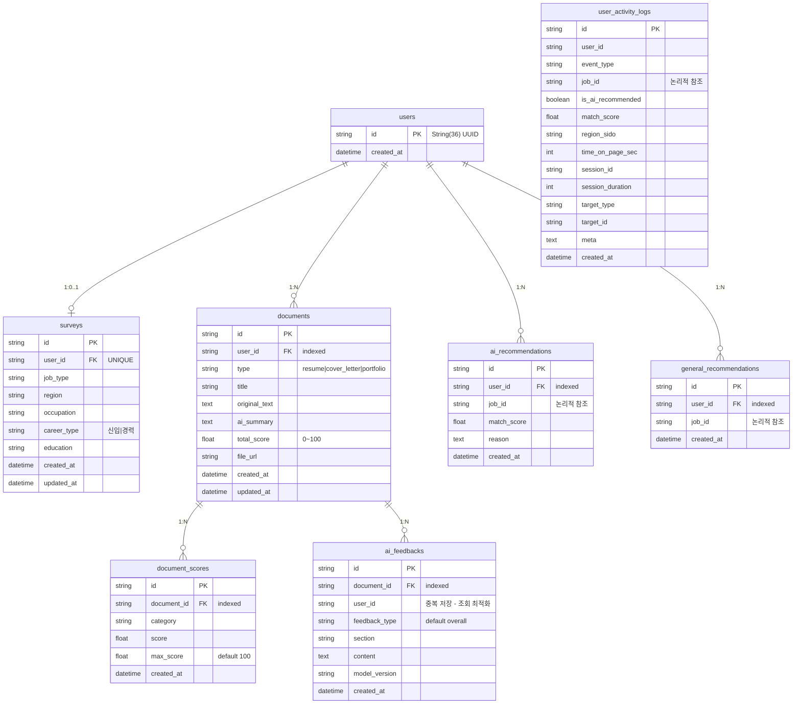
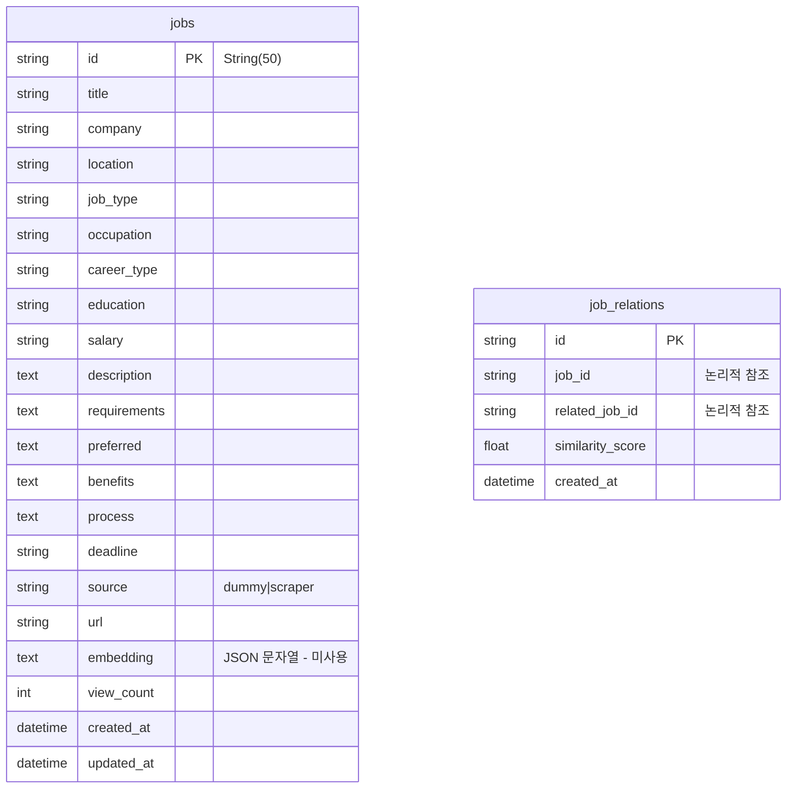
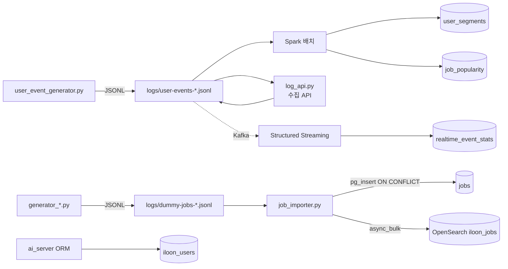

# 데이터 모델 — Illo-on

저장소가 셋이고 역할이 다르다 ([ADR-0001](../adr/0001-storage-split-by-query-type.md)).

| 저장소 | 데이터베이스 / 인덱스 | 용도 |
|---|---|---|
| PostgreSQL | `iloon_users` | 사용자·설문·문서·추천 (ai_server ORM) |
| PostgreSQL | `iloon_jobs` | 공고 + **분석 산출물** (Spark 배치·스트리밍) |
| PostgreSQL | `airflow` | Airflow 메타DB |
| OpenSearch | `iloon_jobs` | 검색·추천 후보 추출 |

---

## 1. ERD — `iloon_users` (ai_server ORM)



`job_id` 는 전부 **논리적 참조**다. 공고가 다른 DB(`iloon_jobs`)에 있어 FK 를 걸 수 없다.

`ai_feedbacks.user_id` 는 `documents` 를 거치면 얻을 수 있는데도 중복 저장한다 —
사용자별 피드백 조회에서 조인을 없애려는 의도다.

## ERD — `iloon_jobs`



**`jobs.embedding` 은 죽은 컬럼이다.** 벡터는 OpenSearch 의 `embedding_vector`
(knn_vector 384d)에 있고, ingest pipeline 이 서버 측에서 만든다. 이 컬럼에 쓰는 코드가 없다.

---

## 2. 분석 산출 테이블 (Spark → `iloon_jobs`)

ORM 이 아니라 각 스크립트가 `CREATE TABLE IF NOT EXISTS` 로 직접 만든다.
**세 테이블 모두 PK·유니크 제약이 없다.**

### `realtime_event_stats` — 스트리밍 집계

| 컬럼 | 타입 |
|---|---|
| `window_start` | TIMESTAMP |
| `window_end` | TIMESTAMP |
| `event_type` | TEXT |
| `is_ai_recommended` | BOOLEAN |
| `event_count` | BIGINT |
| `created_at` | TIMESTAMP DEFAULT NOW() |

쓰기: `foreachBatch` + `executemany`, **`ON CONFLICT ... DO UPDATE`**.

유니크 인덱스 `uq_realtime_event_stats (window_start, event_type, is_ai_recommended)`
**`NULLS NOT DISTINCT`** (PostgreSQL 15+). 이게 없으면 `is_ai_recommended` 가 NULL 인 행이
서로 다른 것으로 취급돼 중복을 막지 못한다.

`ensure_schema()` 가 최초 1회만 돈다 — 테이블 생성 → 기존 중복 정리 → 인덱스 생성.
기존 테이블에 중복이 남아 있으면 인덱스 생성이 실패하므로 `ctid` 기준으로 먼저 정리한다.

실제 PostgreSQL 15.19 로 검증: 중복 4행 → 2행 정리, 같은 배치 3회 재적재해도 3행 유지,
값이 바뀌면 갱신.

### `user_segments` — K-Means 결과

| 컬럼 | 타입 |
|---|---|
| `user_id` | TEXT |
| `cluster_id` | INT |
| `segment_name` | TEXT |
| `view_count` / `bookmark_count` / `apply_count` | BIGINT |
| `apply_rate` / `bookmark_rate` / `ai_view_ratio` / `avg_session_duration` | FLOAT |
| `analyzed_at` | TIMESTAMP DEFAULT NOW() |

쓰기: **`DELETE FROM user_segments` → INSERT** (한 트랜잭션). 멱등하다.
같은 입력으로 재실행해 300행 → 300행(중복 0) 확인.

### `job_popularity` — GBT 예측 결과

| 컬럼 | 타입 |
|---|---|
| `job_id` | TEXT NOT NULL |
| `job_category` / `region` / `career_type` | TEXT |
| `salary_mid` | FLOAT |
| `skill_count` | INT |
| `actual_apply_rate` / `popularity_score` | FLOAT |
| `popularity_grade` | TEXT |
| `analyzed_at` | TIMESTAMP DEFAULT NOW() |

쓰기: **`DELETE FROM job_popularity` → INSERT**. 멱등하다.

---

## 3. OpenSearch 인덱스 `iloon_jobs`

매핑의 단일 출처는 `ai_server/services/opensearch_service.py` 의 `_build_mapping()` 이다
([ADR-0005](../adr/0005-embedding-ingest-pipeline.md) 참조 — 예전엔
`setup_opensearch.py` 가 별도 매핑을 들고 있어 갈라졌다).

### settings

```json
{
  "index": {
    "knn": true,
    "knn.algo_param.ef_search": 100,
    "default_pipeline": "iloon-job-pipeline"
  }
}
```

`default_pipeline` 은 ML 모델이 배포된 경우에만 붙는다.

### mappings

| 필드 | 타입 | 비고 |
|---|---|---|
| `id` | keyword | |
| `search_text` | text | 임베딩 입력. `build_search_text()` 가 조합 |
| `embedding_vector` | **knn_vector (384d)** | hnsw / cosinesimil / lucene |
| `title`, `description`, `requirements` | text (standard) | |
| `preferred`, `benefits` | text | |
| `company`, `location`, `job_type`, `occupation`, `career_type`, `education`, `salary`, `deadline`, `source`, `url` | keyword | |
| `view_count` | integer | |
| `created_at` | date | |

### ingest pipeline `iloon-job-pipeline`

```json
{"processors": [{"text_embedding": {
  "model_id": "<배포된 모델>",
  "field_map": {"search_text": "embedding_vector"}
}}]}
```

모델: `paraphrase-multilingual-MiniLM-L12-v2` (384차원).
색인 시 서버 측에서 벡터를 만든다 — 애플리케이션은 원문만 보낸다.

쓰기: `helpers.async_bulk`, `chunk_size=2000`, `max_chunk_bytes=10MB`,
적재 중 `refresh_interval=-1` (try/finally 복구).
문서 id 를 공고 id 로 고정하므로 재색인은 덮어쓰기가 된다.

---

## 4. ⚠️ 이벤트 스키마가 두 갈래다 — 알려진 불일치

같은 "사용자 행동 이벤트"인데 **정의가 두 곳에 따로 있고 컬럼명이 다르다.**

| 개념 | `UserActivityLog` (ORM, PostgreSQL) | `user_event_generator.py` (JSONL) |
|---|---|---|
| 지역 | `region_sido` | **`region`** |
| 체류 시간 | `time_on_page_sec` | **`session_duration`** |
| 세션 | `session_id` | **없음** |
| 조회 식별 | 없음 | **`view_id`** (이번에 추가) |
| 그 외 | `event_id`, `user_id`, `event_type`, `job_id`, `is_ai_recommended`, `match_score`, `category` | 동일 |

`analyze_ai_vs_normal.py` 는 **JSONL 을 읽으면서 ORM 쪽 컬럼명을 참조**하고 있었다.
그래서 step 2·3·4 가 항상 `Column ... does not exist` 로 실패했다.
JSONL 쪽 이름으로 맞춰 고쳤고, `session_id` 는 이벤트에 아예 없어 `user_id` 로 대체했다.

**해결됨**: 이벤트에 `view_id` 를 넣었다. 조회 1회마다 발급하고 파생 이벤트가 물고 나간다.
`analysis_4` 가 이걸로 조인하면서 전환율이 10.6% → 7.1% 로 잡혔다(설계값 7.0%).
`tests/test_event_schema.py` 가 불변식을 지킨다.

더 근본적으로는 **이벤트 스키마의 단일 출처가 없다.** 생성기·분석기·ORM 이 각자 정의를
들고 있어 언제든 다시 갈라질 수 있다. Pydantic 모델이나 JSON Schema 로 한 곳에 두고
셋이 모두 그것을 참조해야 한다.

---

## 5. 데이터 흐름 요약



`job_importer.py` 만 두 저장소에 동시에 쓴다 —
PostgreSQL 은 `pg_insert ... ON CONFLICT DO UPDATE` (upsert),
OpenSearch 는 bulk. **OpenSearch 색인 실패는 로그만 남기고 계속 진행**하므로
두 저장소가 어긋날 수 있다. 정합성 체크는 미구현이다.
