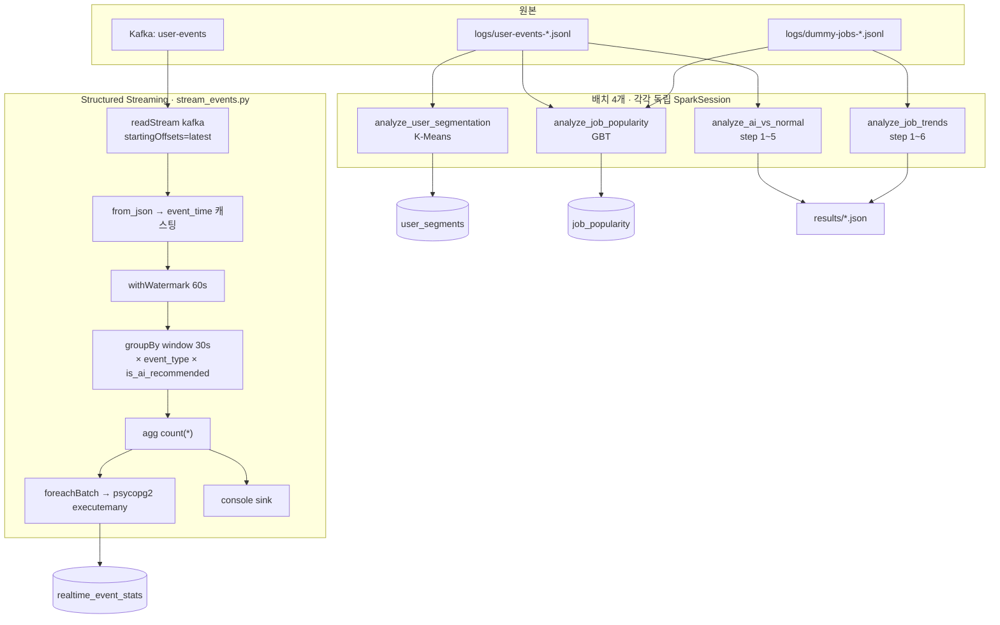

# Spark 내부 구조 — Illo-on

Spark 를 두 갈래로 쓴다. **Structured Streaming 1개**(실시간 집계)와
**배치 잡 4개**(사용자 행동 / 공고 트렌드 / 세그멘테이션 / 인기도 예측)다.
둘은 서로를 읽지 않는다 — 같은 원본 JSONL 을 각자 읽는다.



---

## 1. Structured Streaming — `tools/stream_events.py`

### 파이프라인

| 단계 | 구현 |
|---|---|
| 소스 | `readStream.format("kafka")`, `subscribe=user-events`, `startingOffsets=latest` |
| 파싱 | `CAST(value AS STRING)` → `from_json` → `event_time` 캐스팅 |
| 워터마크 | `withWatermark("event_time", "60s")` (기본값, `--watermark` 로 조정) |
| 집계 | `window(event_time, "30 seconds")` × `event_type` × `is_ai_recommended` → `count(*)` |
| 트리거 | `processingTime="30 seconds"` |
| 싱크 1 | `foreachBatch(write_to_postgres)` → `realtime_event_stats` |
| 싱크 2 | `console` (`truncate=false`) |
| 체크포인트 | `checkpoints/pg_stream`, `checkpoints/console_stream` (싱크별로 분리) |

### 설계상 짚을 점

**`outputMode("append")` + 워터마크 조합.** append 모드는 윈도우가 워터마크를 넘겨
확정된 뒤에야 내보낸다. 여기에 트리거가 두 번 붙는다 — 워터마크를 넘기는 이벤트를 읽는
배치 한 번, 그 워터마크로 방출하는 **다음** 배치 한 번. 선언값만 더하면
**윈도우 30s + 워터마크 60s + 트리거 30s×2 = 150s** 가 상한이다.
지연 데이터를 버리는 대신 같은 윈도우를 두 번 쓰지 않는다. `update` 모드였다면
같은 윈도우가 갱신될 때마다 다시 나오므로 append-only INSERT 와 맞지 않는다.

**워터마크는 `event_time` 에서만 전진한다.** 트래픽이 끊기면 마지막 윈도우는 닫히지 않고
남는다. 지연을 재려면 측정 중 배경 트래픽을 계속 넣어야 하는 이유이고
(`bench/stream_latency.py` 의 하트비트), 운영에서는 이벤트가 뜸한 시간대의 마지막 집계가
다음 이벤트가 올 때까지 적재되지 않는다는 뜻이다.

**실측** (Kafka produce → `realtime_event_stats` 적재, 프로브 6회, 하트비트 1건/초):
p50 **132.5s** · 최대 **150.1s**. 윈도우가 닫힌 뒤의 몫은 120.5~121.1s 로 거의 상수고
(선언값 120s + 배치 실행·적재 0.5~1.1s), 나머지는 전부 이벤트가 30초 윈도우의 어디에
떨어졌는가다. 근거와 조건은 [docs/metrics.md](../metrics.md).

**`foreachBatch` 안에서 `collect()` 를 한다.** 마이크로배치 결과를 드라이버로 모아
`psycopg2.executemany` 로 넣는다. 배치당 행 수가 (윈도우 1개 × event_type 3종 ×
is_ai 2종) 수준이라 작아서 가능한 선택이다. 이벤트 원본이 아니라 **집계 결과**를
쓰기 때문에 성립한다. 원본을 그대로 적재했다면 JDBC 싱크나 파티션별 쓰기로 갔어야 한다.

**psycopg2 가 없으면 조용히 건너뛴다.** `ImportError` 를 잡아 warning 만 남기고 return 한다.
스트리밍이 죽지는 않지만 그 배치의 집계는 사라진다 — 콘솔 싱크에만 남는다.

### 한계

- `startingOffsets=latest` 라 재시작 시 체크포인트가 없으면 그 사이 이벤트를 건너뛴다.
- **Windows 호스트에서는 잡이 뜨지 않는다.** 체크포인트 디렉터리 생성이
  `NativeIO$Windows.access0` 에서 실패한다(hadoop.dll 필요). 컨테이너에서 실행한다 —
  `docker compose run` 명령은 [docs/metrics.md](../metrics.md) 의 재현 절에 있다.
- 지연의 절반이 워터마크(60s)다. 줄이면 지연은 줄지만 늦게 도착하는 이벤트를 더 버린다.

---

## 2. 배치 잡 공통

네 잡 모두 **독립된 SparkSession** 을 띄운다. Airflow 에서 태스크마다 별도 프로세스로
실행되므로 JVM 도 따로 뜬다. 병렬화할 때 `max_active_tasks=4` 로 제한한 이유가 이것이다
([ADR-0002](../adr/0002-dag-dependency-and-input-gate.md)).

| 잡 | appName | shuffle.partitions | driver.memory | 기타 |
|---|---|---|---|---|
| `analyze_ai_vs_normal` | `ai_vs_normal_analysis` | 4 | — | `master=local[*]` |
| `analyze_job_trends` | `iloon-job-trend-analysis` | 4 | 1g | `timeParserPolicy=LEGACY` |
| `analyze_user_segmentation` | `user_segmentation` | 4 | — | `master=local[*]` |
| `analyze_job_popularity` | `iloon-job-popularity` | 4 | 1g | — |

`shuffle.partitions=4` — 기본값 200 은 이 데이터 규모(이벤트 24만 행)에서 과하다.
파티션당 수백 행짜리 태스크 200개를 만드느니 4개가 낫다.

`timeParserPolicy=LEGACY` 는 `analyze_job_trends` 에만 있다. 공고의 날짜 형식이
Spark 3 의 기본 파서로는 안 읽히는 것이 섞여 있다.

### 공통 구조

각 스크립트가 `--step N` 을 받아 **한 단계만** 실행한다. `run_step()` 이
SparkSession 생성 → `load_data()` → 해당 분석 함수 → `spark.stop()` 을 한 번에 한다.

이 구조 때문에 **병렬 실행 시 같은 JSONL 을 태스크마다 다시 읽는다.** 24만 행 × 13태스크다.
캐시를 공유할 방법이 없다(프로세스가 다르다). 대신 태스크 단위 재시도가 쉽고
한 단계 실패가 다른 단계를 막지 않는다. DAG 병렬화로 41% 줄인 것은 이 중복 읽기를
감수한 결과다.

---

## 3. `analyze_ai_vs_normal` — 사용자 행동 (step 1~5)

입력: `logs/user-events-*.jsonl`

| step | 분석 | 핵심 연산 |
|---|---|---|
| 1 | AI vs 일반 전환율 | `groupBy(is_ai_recommended).pivot(event_type)` → 저장률·지원률 |
| 2 | 지역별 AI 전환율 | `filter(is_ai=true).groupBy(region).pivot(event_type)` |
| 3 | 체류 시간 비교 | `groupBy(is_ai).agg(avg/min/max(session_duration))` |
| 4 | 매칭 점수 구간별 전환율 | 조회 ⋈ 지원 `left join` → `score_bucket` 파생 → groupBy |
| 5 | 일별 전환율 트렌드 | `date` 파생 → `groupBy(date, is_ai).pivot` |

**step 4 는 구조적으로 계산할 수 없다.** 조회와 지원을 잇는 키가 이벤트에 없다.
`(user_id, job_id)` 로 조인하는데 같은 사용자가 같은 공고를 평균 1.30회 보므로 팬아웃이 생긴다.
게다가 `match_score` 가 `uniform(0.65, 0.98)` 로 공고마다 한 번 뽑히고 지원 확률과
무관해서, 결과는 어차피 평평하다(10.5 / 10.7 / 10.9 / 10.6%).
자세한 근거는 [ADR-0009](../adr/0009-why-recommendation-accuracy-not-measured.md).

---

## 4. `analyze_job_trends` — 공고 트렌드 (step 1~6)

입력: `logs/dummy-jobs-*.jsonl` (중첩 JSON)

직군 분포 / 기술스택 Top 20 / 직군별 연봉 / 지역 분포 / 경력×기업규모 / 일별 등록 추이.
중첩 필드를 `position.job_category.mid` 같은 경로로 꺼내 쓰고,
기술스택은 `explode(skills)` 후 집계한다.

---

## 5. `analyze_user_segmentation` — K-Means

```
사용자별 집계 → VectorAssembler → StandardScaler → KMeans(k=4) → 세그먼트 라벨링
```

**피처 7개** (`FEATURE_COLS`)

```
view_count, bookmark_count, apply_count,
apply_rate, bookmark_rate, ai_view_ratio, avg_session_duration
```

| 항목 | 값 |
|---|---|
| `KMeans` | `k=4`(기본, `--k` 로 조정), `maxIter=20`, `seed=42` |
| `StandardScaler` | 적용 — 카운트(수백)와 비율(0~1) 스케일 차이가 커서 필수 |
| 라벨링 | 클러스터 통계로 `assign_segment_names()` 가 이름 부여. Python UDF 대신 `when/otherwise` 체인 |

`seed=42` 고정이라 **같은 입력이면 같은 클러스터가 나온다.**
세그먼트 *이름* 은 클러스터 통계(평균 지원율 등)로 사후 부여하므로,
데이터가 바뀌면 같은 cluster_id 에 다른 이름이 붙을 수 있다.

출력: `user_segments` 테이블 (`DELETE` 후 `INSERT`) + `results/user_segments.json`

---

## 6. `analyze_job_popularity` — GBTRegressor

```
공고 특성 ⋈ 이벤트 통계 → StringIndexer × N → VectorAssembler → StandardScaler → GBT
```

| 항목 | 값 |
|---|---|
| 모델 | `GBTRegressor(labelCol="apply_rate", maxIter=30, maxDepth=4, seed=42)` |
| 범주형 | `StringIndexer(handleInvalid="keep")` — 학습에 없던 값이 와도 죽지 않게 |
| 수치 피처 | `salary_mid`, `skill_count`, `view_count`, `bookmark_count` |
| 분할 | `randomSplit([0.8, 0.2], seed=42)` |
| 평가 | `RegressionEvaluator` — RMSE / R² / MAE |
| 저장 | `PipelineModel` → `results/job_popularity_model/` (`write().overwrite()`) |

`Pipeline(stages=indexers + [assembler, scaler, gbt])` 로 묶여 있어
학습과 예측이 같은 전처리를 탄다 — 추론 시 전처리가 갈라지는 사고가 구조적으로 막힌다.

**주의**: 이 모델의 성능 지표(R² 등)는 의미가 없다. 학습 타깃인 `apply_rate` 의 원천인
조회수·지원수가 시뮬레이터에서 `is_ai` 로만 갈리는 uniform random 이기 때문이다.
모델 파이프라인 구성 자체는 유효하지만 **수치를 성과로 인용하면 안 된다**
([ADR-0009](../adr/0009-why-recommendation-accuracy-not-measured.md)).

---

## 7. 별도 — 벤치마크용 Spark 없는 경로

`bench/` 의 측정 스크립트는 Spark 를 쓰지 않는다. 색인·API·검색 품질 측정이라
Spark 가 개입할 여지가 없고, JVM 기동 시간이 측정에 섞이면 곤란하다.
